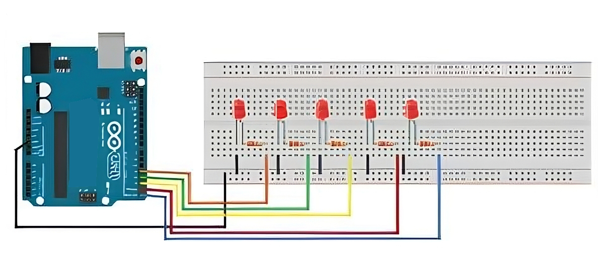

# Simple - Running LED from Right to Left (No-Library)

- Light Emitting Diode or often abbreviated as LED is an electronic component that can emit monochromatic light when a forward voltage is applied. LED is a family of diodes made from semiconductor materials. The colors of light emitted by LEDs depend on the type of semiconductor material used. LEDs can be used in various applications, for example LEDs can be controlled using Arduino to light up for a specified time.

## Features

- Sequentially lights up 5 LEDs from right to left.
- No additional libraries required.
- Simple control of digital pins with `digitalWrite`.

# Schematic:

- Below you can see a schematic image to facilitate the wiring of cables from the microcontroller to devices, both input and output sensors:



## Components

- Arduino Uno = 1 unit;
- 5 LEDs = 5 units;
- 220Ω resistors = 5 units (for current limiting);
- Jumper wires;
- Breadboard / Project Board.

## Pin Configuration

- **LED Connections**:
  - LED 1 → Pin 0
  - LED 2 → Pin 1
  - LED 3 → Pin 2
  - LED 4 → Pin 3
  - LED 5 → Pin 4
  - Connect the other ends of the LEDs to ground through resistors.

## How It Works

1. **Initialization**: In the `setup()` function, the digital pins 0 to 4 are set as outputs.
2. **LED Sequence**: In the `loop()` function, each LED lights up in sequence from pin 0 to pin 4 with a 1-second delay, simulating a running effect.

## Code Explanation

```cpp
void setup() {
    pinMode(0, OUTPUT); // Set digital pins 0-4 as outputs
    pinMode(1, OUTPUT);
    pinMode(2, OUTPUT);
    pinMode(3, OUTPUT);
    pinMode(4, OUTPUT);
}

void loop() {
    digitalWrite(0, HIGH); // Light up LED on pin 0
    digitalWrite(1, LOW);
    digitalWrite(2, LOW);
    digitalWrite(3, LOW);
    digitalWrite(4, LOW);
    delay(1000); // Wait for 1 second

    digitalWrite(0, LOW); // Light up LED on pin 1
    digitalWrite(1, HIGH);
    digitalWrite(2, LOW);
    digitalWrite(3, LOW);
    digitalWrite(4, LOW);
    delay(1000);

    digitalWrite(0, LOW); // Light up LED on pin 2
    digitalWrite(1, LOW);
    digitalWrite(2, HIGH);
    digitalWrite(3, LOW);
    digitalWrite(4, LOW);
    delay(1000);

    digitalWrite(0, LOW); // Light up LED on pin 3
    digitalWrite(1, LOW);
    digitalWrite(2, LOW);
    digitalWrite(3, HIGH);
    digitalWrite(4, LOW);
    delay(1000);

    digitalWrite(0, LOW); // Light up LED on pin 4
    digitalWrite(1, LOW);
    digitalWrite(2, LOW);
    digitalWrite(3, LOW);
    digitalWrite(4, HIGH);
    delay(1000);
}
```

## Information:

- • pinMode(): Used to set each pin as an output.
- • digitalWrite(): Controls each LED by setting the corresponding pin HIGH (on) or LOW (off).
- • delay(): Waits for 1 second between each LED change.

## Usage

1. Connect the LEDs and resistors to the corresponding pins as per the configuration. <br/>
2. Upload the code to your Arduino Uno. <br/>
3. Power the Arduino and observe the LEDs running from right to left. <br/>

## Conclusion

- This simple project demonstrates how to control LEDs in sequence without using external libraries. It provides a basic understanding of how to manipulate digital pins and create timing delays for visual effects.
- This program will turn the LED on and off from right to left alternately at intervals of every one second.
  <br/>
"# Simple-Running-LED" 
